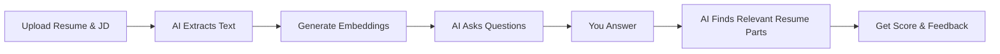
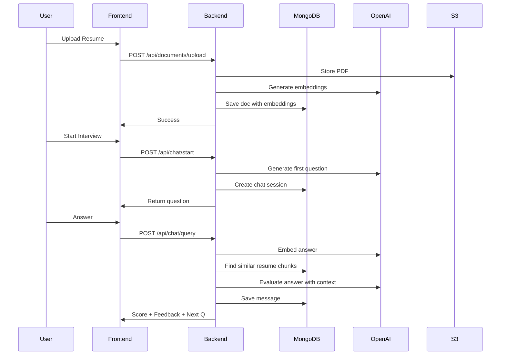
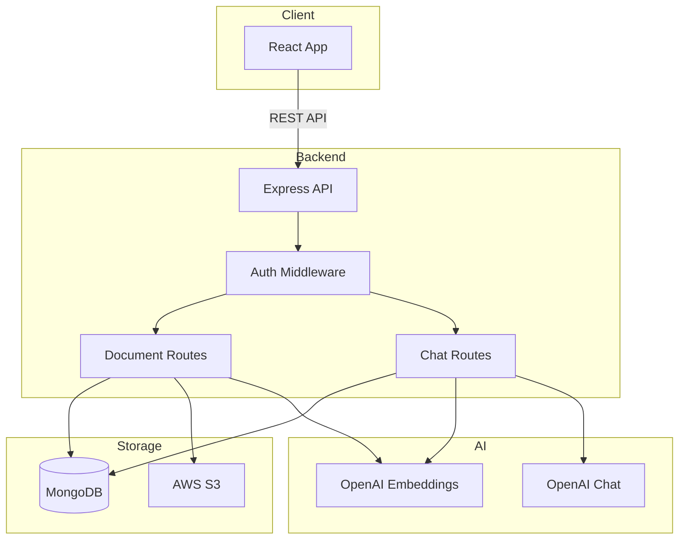

# AI Interview Prep

Practice interviews with an AI that knows your resume and the job you're applying for.


## What it does

Upload your resume + job description → AI asks you interview questions → Get instant feedback with scores.

## Screenshots

<table>
  <tr>
    <td></td>
    <td></td>
  </tr>
</table>

## How it works



## Quick Start

```bash
git clone https://github.com/Swayanshu18/interview_ai_resumeparser.git
cd interview-prep-app

# Backend
cd backend
npm install
cp .env.example .env
# Add your MongoDB URI and OpenAI key
npm run dev

# Frontend (new terminal)
cd frontend
npm install
npm run dev
```

Visit `http://localhost:3000`

## Tech Stack

**Frontend:** React + Tailwind + Vite
**Backend:** Node.js + Express + MongoDB
**AI:** OpenAI (embeddings + chat)
**Storage:** AWS S3

## Folder Structure

```
interview-prep-app/
├── backend/
│   ├── models/           # User, Document, Chat schemas
│   ├── routes/           # API endpoints
│   ├── utils/            # AI & S3 helpers
│   └── server.js
├── frontend/
│   ├── src/
│   │   ├── pages/        # Landing, Upload, Chat
│   │   ├── components/   # Reusable UI
│   │   └── services/     # API calls
│   └── vite.config.js
└── README.md
```

## Features

- 🔐 JWT auth with bcrypt
- 📄 PDF upload & parsing
- 🤖 AI question generation from job description
- 📊 Scored feedback (1-10) with citations
- 🎯 RAG - AI references your actual resume in feedback
- ⚡ Sequential questions (one at a time)
- 💬 End-of-interview comprehensive evaluation

## API Flow



## Environment Variables

**Backend:**
```env
MONGODB_URI=mongodb+srv://...
JWT_SECRET=your-secret
AWS_ACCESS_KEY_ID=...
AWS_SECRET_ACCESS_KEY=...
AWS_S3_BUCKET_NAME=interview-docs
OPENAI_API_KEY=sk-...
```

**Frontend:**
```env
VITE_API_URL=http://localhost:5000/api
```

## Deploy on Vercel

**Backend:**
```bash
cd backend
vercel --prod
# Add env vars in Vercel dashboard
```

**Frontend:**
```bash
cd frontend
vercel --prod
```

Check [FINAL_DEPLOYMENT_GUIDE.md](./FINAL_DEPLOYMENT_GUIDE.md) for detailed steps.

## System Architecture



## License

MIT

---

Built for interview prep. Made by [Swayanshu Rout](https://github.com/Swayanshu18)
